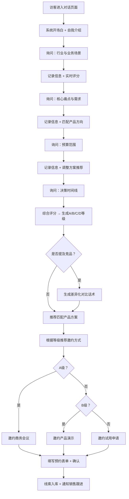

## 1. 产品概述
智能销售线索培育系统，通过拟人化对话与潜在客户进行初步沟通，渐进式挖掘关键业务信息，自动完成线索分级与产品方案匹配，最终实现高质量的销售转化邀约。
- 主要解决销售团队初期线索筛选效率低、客户沟通不规范、优质线索流失率高的痛点
- 目标用户为B2B企业的销售团队、市场运营人员，以及需要自动化线索培育的SaaS产品厂商
- 产品价值在于：将人工线索培育效率提升5-10倍，线索分级准确率提升至85%以上，销售转化率提升30%+

## 2. 核心功能

### 2.1 用户角色
| 角色 | 注册方式 | 核心权限 |
|------|----------|----------|
| 销售人员 | 账号登录 | 查看线索列表、手动干预对话、导出报告、管理产品库 |
| 管理员 | 管理员账号 | 系统配置、话术库管理、团队数据统计、权限管理 |
| 潜在客户 | 无需注册 | 通过聊天窗口与系统对话、获取产品信息、预约下一步行动 |

### 2.2 功能模块
1. **智能对话中心**：拟人化聊天界面、渐进式提问引擎、上下文理解、多轮对话管理
2. **线索分级引擎**：自动收集关键信息（业务场景/预算/决策时间线）、A/B/C/D四级评分算法、实时线索看板
3. **产品方案推荐**：基于行业标签匹配、需求场景智能映射、方案卡片可视化展示
4. **竞品对比助手**：竞品关键词识别、差异化卖点自动生成、多维度对比话术
5. **行动邀约模块**：产品演示预约、试用申请、商务会议排期、日历同步
6. **线索管理看板**：线索列表、分级筛选、详情查看、导出报告、跟进状态追踪

### 2.3 页面详情
| 页面名称 | 模块名称 | 功能描述 |
|-----------|-------------|---------------------|
| 线索培育对话页 | 聊天窗口 | 实时对话显示、消息气泡、输入框、快捷回复建议 |
| 线索培育对话页 | 渐进式提问 | 根据对话进度自动弹出下一个关键问题、支持跳过/稍后回答 |
| 线索培育对话页 | 线索分级指示器 | 实时显示当前线索评分和等级、进度条动画 |
| 线索培育对话页 | 产品推荐卡片 | 嵌入对话中的产品方案卡片、方案详情预览跳转 |
| 线索培育对话页 | 竞品对比模块 | 检测到竞品关键词自动触发、生成专业对比话术 |
| 线索培育对话页 | 行动邀约面板 | 三种邀约方式选择、时间选择器、表单提交确认 |
| 线索管理看板 | 线索列表 | 分页展示、多维度筛选（等级/行业/日期/状态）、批量操作 |
| 线索管理看板 | 统计仪表盘 | 各级别线索数量饼图、转化率趋势、行业分布、每日新增 |
| 线索管理看板 | 线索详情抽屉 | 完整对话记录、客户画像标签、推荐方案、跟进记录 |
| 产品方案管理页 | 产品库列表 | 产品卡片展示、行业标签、核心卖点、价格区间配置 |
| 产品方案管理页 | 竞品管理 | 竞品信息录入、差异化卖点维护、对比话术模板 |
| 系统配置页 | 话术配置 | 开场白、行业适配话术、转化话术、邀约话术的自定义 |
| 系统配置页 | 分级规则配置 | A/B/C/D各级评分权重调整、关键指标阈值设置 |

## 3. 核心流程
潜在客户进入系统后，系统以专业亲和的开场白建立连接，然后通过渐进式提问依次挖掘客户的**行业与业务场景**、**痛点与需求**、**预算范围**、**决策时间线**四个核心维度。系统根据收集到的信息实时计算线索评分并展示分级结果，同时匹配推荐最适合的产品方案。若客户提及竞品，系统自动触发对比话术。当对话进入成熟阶段，系统根据线索等级推荐合适的下一步行动（A级推荐商务会议，B级推荐产品演示，C级推荐试用申请），最终完成预约。销售团队可在线索看板中查看所有线索，进行后续跟进。

## 4. 用户界面设计
### 4.1 设计风格
- **主色调**：深海蓝 `#1e3a8a`（专业信任），搭配青碧绿 `#0d9488`（增长活力）作为强调色
- **辅助色**：暖金色 `#f59e0b`（高价值线索）、珊瑚橙 `#ef4444`（紧急行动）、中性灰阶
- **按钮风格**：圆角12px的胶囊按钮，主按钮采用渐变蓝，悬停有微上浮+光晕效果
- **字体**：标题使用 **Noto Serif SC**（衬线体，建立权威感），正文使用 **PingFang SC / Microsoft YaHei**（清晰易读）
- **布局风格**：双栏布局（左侧聊天区70% + 右侧信息栏30%），卡片式模块化设计，大量留白营造呼吸感
- **图标风格**：线性图标为主，关键节点使用品牌色填充，配合微动画增强反馈
- **整体调性**：高端商务风 × 温柔科技感，避免冷硬的技术感，突出专业且可信赖的顾问形象

### 4.2 页面设计概述
| 页面名称 | 模块名称 | UI元素 |
|-----------|-------------|-------------|
| 线索培育对话页 | 顶部导航栏 | 品牌Logo、当前线索编号、等级徽章、保存/导出按钮 |
| 线索培育对话页 | 左侧聊天区 | 渐变背景（浅蓝→白）、时间戳分隔、头像气泡、打字指示器动画 |
| 线索培育对话页 | 右侧信息栏 | 客户画像卡片（标签云）、评分进度环、推荐方案迷你卡、快捷操作按钮组 |
| 线索培育对话页 | 输入区域 | 多行输入框、附件按钮、表情、快捷回复气泡、发送按钮（渐变蓝） |
| 线索管理看板 | 统计仪表盘 | 四个等级卡片带数字动画、趋势折线图（淡入）、饼图hover高亮 |
| 线索管理看板 | 线索列表 | 斑马纹行、等级彩色徽章、hover展开快捷操作、平滑过渡 |
| 产品方案管理页 | 产品卡片 | 图片+标题+标签网格布局、hover翻转显示卖点、渐变边框强调 |
| 系统配置页 | 表单区域 | 分区折叠面板、开关组件、滑块调整权重、实时预览效果 |

### 4.3 响应式
- 桌面端（1440px+）：双栏布局充分利用空间，信息密度适中
- 平板端（768px-1439px）：右侧信息栏可折叠为抽屉，聊天区自适应宽度
- 移动端（<768px）：单栏沉浸式聊天界面，线索信息通过底部滑出面板访问，触控按钮≥44px
- 触摸优化：所有可点击区域添加触觉反馈视觉效果，滑动操作流畅自然

### 4.4 动画与交互细节
- 页面加载：顶部进度条 + 各模块错落淡入（100ms间隔）
- 消息气泡：进入时从底部滑入+透明度渐变，系统消息带轻微呼吸效果
- 打字指示器：三个圆点依次上下跳动，模拟真人输入
- 评分更新：数字滚动动画 + 进度环渐变填充
- 产品卡片：hover时3°微旋转 + 阴影加深 + 光晕扩散
- 邀约成功：彩色纸屑粒子动画 + 确认信息放大弹出
