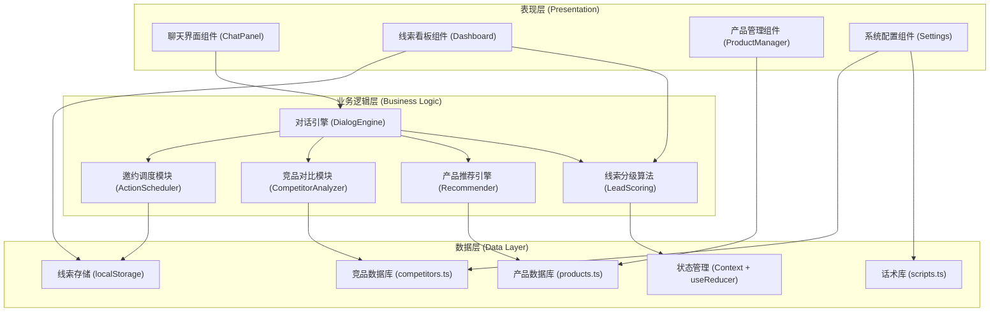
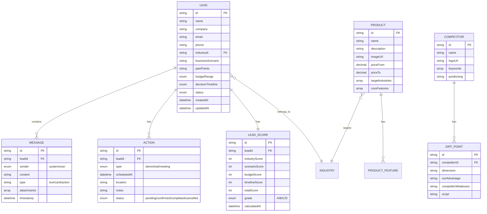

## 1. 架构设计
本系统采用纯前端实现的单页应用架构，核心业务逻辑（对话引擎、线索分级、产品推荐、竞品对比）均在浏览器端运行，使用本地存储和Mock数据模拟后端服务，确保系统开箱即用、无需部署。



## 2. 技术说明
- **前端框架**：React@18 + TypeScript（类型安全，大型项目可维护）
- **初始化工具**：Vite@5（极速HMR，构建性能优异）
- **样式方案**：TailwindCSS@3 + CSS变量（快速开发 + 设计Token统一管理）
- **状态管理**：React Context + useReducer（无需额外依赖，满足中等复杂度）
- **路由方案**：React Router@6（SPA多页面导航）
- **图表可视化**：Recharts（React生态最成熟的数据可视化库）
- **图标库**：Lucide React（线性风格，符合设计调性）
- **动画库**：Framer Motion（流畅的页面过渡和微交互）
- **表单处理**：React Hook Form + Zod（表单验证 + 类型推导）
- **日期处理**：date-fns（轻量日期工具库）
- **后端**：无（纯前端实现，localStorage持久化）
- **数据库**：无（内置Mock数据，支持导出JSON）

## 3. 路由定义
| 路由路径 | 页面名称 | 核心组件 | 页面用途 |
|----------|----------|----------|----------|
| `/` | 对话入口页 | EntryPage | 新访客入口，输入基本信息后开始对话 |
| `/chat/:leadId` | 线索培育对话页 | ChatPage | 核心对话界面，包含聊天、评分、推荐、邀约 |
| `/dashboard` | 线索管理看板 | DashboardPage | 统计数据、线索列表、搜索筛选 |
| `/dashboard/lead/:leadId` | 线索详情页 | LeadDetailPage | 完整对话记录、客户画像、跟进操作 |
| `/products` | 产品方案管理 | ProductsPage | 产品库CRUD、行业标签配置 |
| `/products/competitors` | 竞品管理 | CompetitorsPage | 竞品信息维护、差异化卖点配置 |
| `/settings` | 系统配置 | SettingsPage | 话术库编辑、分级规则调整 |

## 4. 数据模型
### 4.1 核心数据实体定义



### 4.2 TypeScript 类型定义（核心）
```typescript
// 线索相关
export type LeadGrade = 'A' | 'B' | 'C' | 'D';
export type BudgetRange = 'LESS_THAN_50K' | '50K_200K' | '200K_500K' | '500K_1M' | 'ABOVE_1M' | 'UNSPECIFIED';
export type DecisionTimeline = 'IMMEDIATE' | 'WITHIN_1M' | 'WITHIN_3M' | 'WITHIN_6M' | 'LONG_TERM' | 'UNSPECIFIED';
export type LeadStatus = 'NEW' | 'QUALIFYING' | 'QUALIFIED' | 'PROPOSAL' | 'NEGOTIATION' | 'CLOSED_WON' | 'CLOSED_LOST';

export interface Lead {
  id: string;
  name: string;
  company: string;
  email: string;
  phone: string;
  industryId: string;
  businessScenario: string;
  painPoints: string[];
  budgetRange: BudgetRange;
  decisionTimeline: DecisionTimeline;
  status: LeadStatus;
  tags: string[];
  createdAt: string;
  updatedAt: string;
}

// 对话相关
export type MessageType = 'TEXT' | 'PRODUCT_CARD' | 'ACTION_INVITE' | 'COMPETITOR_COMPARISON' | 'GRADE_UPDATE';
export type MessageSender = 'SYSTEM' | 'USER';

export interface Message {
  id: string;
  leadId: string;
  sender: MessageSender;
  content: string;
  type: MessageType;
  payload?: Record<string, any>;
  timestamp: string;
}

// 评分相关
export interface LeadScore {
  leadId: string;
  industryScore: number;
  scenarioScore: number;
  budgetScore: number;
  timelineScore: number;
  totalScore: number;
  grade: LeadGrade;
  calculatedAt: string;
}

// 产品相关
export interface Product {
  id: string;
  name: string;
  description: string;
  imageUrl: string;
  priceFrom: number;
  priceTo: number;
  targetIndustries: string[];
  targetScenarios: string[];
  coreFeatures: ProductFeature[];
}

export interface ProductFeature {
  name: string;
  description: string;
  icon: string;
}

// 竞品相关
export interface Competitor {
  id: string;
  name: string;
  logoUrl: string;
  keywords: string[];
  positioning: string;
  diffPoints: DiffPoint[];
}

export interface DiffPoint {
  dimension: string;
  ourAdvantage: string;
  competitorWeakness: string;
  script: string;
}

// 邀约相关
export type ActionType = 'DEMO' | 'TRIAL' | 'MEETING';
export type ActionStatus = 'PENDING' | 'CONFIRMED' | 'COMPLETED' | 'CANCELLED';

export interface ScheduledAction {
  id: string;
  leadId: string;
  type: ActionType;
  scheduledAt: string;
  duration: number;
  location: string;
  notes: string;
  status: ActionStatus;
}
```

## 5. 核心算法与逻辑设计
### 5.1 线索分级算法 (A/B/C/D)
```typescript
// 评分维度权重（可配置）
const WEIGHTS = {
  industryMatch: 0.15,   // 行业匹配度
  scenarioClarity: 0.25, // 业务场景清晰度
  budgetRange: 0.30,     // 预算范围
  decisionTimeline: 0.30 // 决策时间线
};

// 评分标准
function calculateGrade(score: LeadScore): LeadGrade {
  const { totalScore } = score;
  if (totalScore >= 85) return 'A'; // 高价值，立即跟进
  if (totalScore >= 65) return 'B'; // 较优质，重点培育
  if (totalScore >= 40) return 'C'; // 一般质量，持续跟进
  return 'D';                        // 低质量，长期培育
}

// 各维度评分细则示例
function scoreBudget(range: BudgetRange): number {
  const mapping = {
    ABOVE_1M: 100,
    '500K_1M': 85,
    '200K_500K': 70,
    '50K_200K': 45,
    LESS_THAN_50K: 20,
    UNSPECIFIED: 10
  };
  return mapping[range];
}
```

### 5.2 渐进式提问状态机
对话引擎采用有限状态机（FSM）管理提问流程：
- 状态：`GREETING` → `ASK_INDUSTRY` → `ASK_SCENARIO` → `ASK_PAIN_POINTS` → `ASK_BUDGET` → `ASK_TIMELINE` → `RECOMMENDATION` → `INVITATION` → `CLOSING`
- 每个状态对应1-2个特定问题，收集完信息自动转入下一状态
- 支持状态回退（用户补充回答之前的问题）和跳过（用户表示暂不方便透露）
- 检测到竞品关键词时插入`COMPETITOR_HANDLING`临时状态

### 5.3 产品推荐匹配算法
1. **行业匹配**（权重40%）：产品目标行业 ∩ 客户行业
2. **场景匹配**（权重35%）：产品目标场景 ∩ 客户描述的业务场景（关键词匹配+语义相似度）
3. **预算匹配**（权重25%）：客户预算区间与产品价格区间的重叠度

最终计算每个产品的综合匹配度得分，返回Top 3推荐结果。
